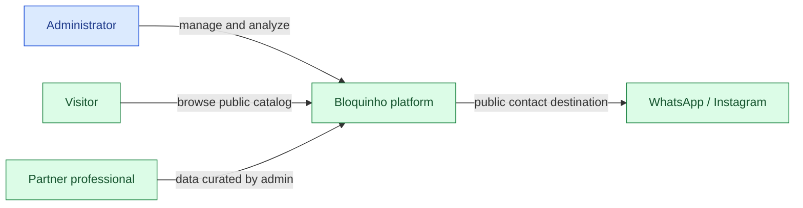
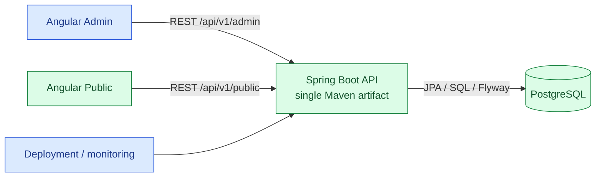
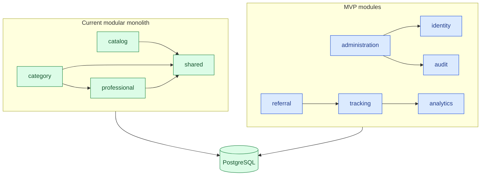
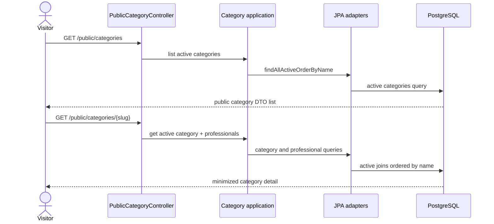
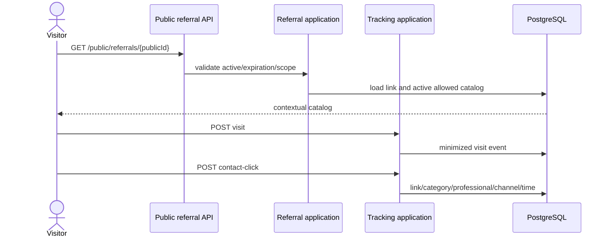
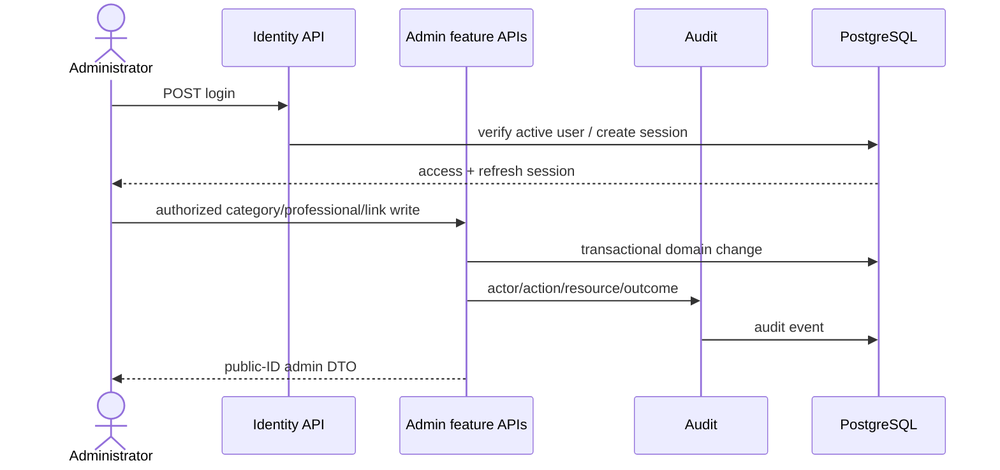
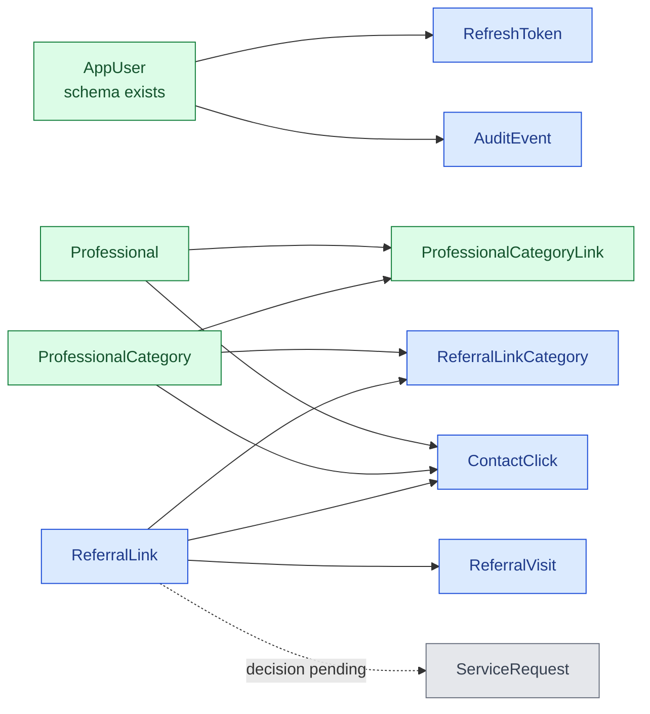

# Architecture

## Classification and legend

Bloquinho API is one Maven-built, Spring Boot deployable: a feature-oriented modular monolith with layered/hexagonal influence. It uses one PostgreSQL database owned exclusively by the API. Package boundaries are conventions, not separate Maven modules.

- Green / `IMPLEMENTADO`: exists in the current repository.
- Blue / `PLANEJADO_MVP`: specified for the MVP but absent from code.
- Gray / `FUTURO`: explicitly after MVP.

## System context



Administrator workflows are planned; visitor catalog access and contact values are implemented. Partner professionals have no account in the MVP.

## Containers



The frontend repositories are separate by ADR-003. Their runtime state is outside this backend repository. Local infrastructure provides PostgreSQL through Compose; CI uses Java 21, the Maven Wrapper, and Testcontainers. Production deployment/observability are planned.

## Backend modules and components

Current modules:

- `catalog` — `IMPLEMENTADO`: fixed public application status controller.
- `category` — `IMPLEMENTADO`: API, application use cases, domain record/port, JPA entity/repository/adapter.
- `professional` — `IMPLEMENTADO`: public DTO, category-scoped use case, domain record/port, JPA entity/repository/adapter.
- `shared` — `IMPLEMENTADO`: security/CORS, Problem Details advice, public ID generator.

Planned modules:

- `identity` — `PLANEJADO_MVP`: administrator/session/refresh.
- `administration` — `PLANEJADO_MVP`: secured management orchestration; feature writes should remain with owning modules.
- `referral` — `PLANEJADO_MVP`: link lifecycle and category scope.
- `tracking` — `PLANEJADO_MVP`: visits and contact clicks.
- `analytics` — `PLANEJADO_MVP`: read-side aggregates.
- `audit` — `PLANEJADO_MVP`: administrative/security evidence.



## Internal dependency pattern

```text
Web/API → Application → Domain ← Infrastructure
```

Controllers map HTTP to application services. Application services orchestrate domain ports. Domain packages hold records and repository interfaces. Infrastructure implements those ports through Spring Data JPA. Spring annotations in application code and direct `category.application → professional.application` coupling mean this is not strict ports-and-adapters.

Flyway owns schema evolution; Hibernate uses `ddl-auto=validate` and `open-in-view=false`. Existing migrations are immutable. Testcontainers exercises persistence against PostgreSQL 18.

## Existing public flow



This flow is `IMPLEMENTADO`. It exposes contact values but does not create a referral context or track an event.

## Planned referral flow



All participants except visitor/database are `PLANEJADO_MVP`; tracking failure behavior and privacy details remain `DECISAO_PENDENTE`.

## Planned administrative flow



This flow is `PLANEJADO_MVP`. Current `/api/v1/admin/**` is `denyAll()` and has no controller.

## Domain overview



The detailed entity/invariant/retention model is in [Domain model](DOMAIN_MODEL.md).

## Security, infrastructure, and observability

Spring Security currently provides explicit public allowlists, CORS, OPTIONS, and default/admin denial; it does not authenticate. Identity and production hardening are planned in [Security](SECURITY.md).

The current chain disables CSRF, keeps Spring Security's default `IF_REQUIRED` session policy, has an empty in-memory user manager, and configures neither HTTP Basic, form login nor JWT. GET documentation and health are public; only health is exposed through Actuator. Full-context tests exercise these technical endpoints with the real filter chain and PostgreSQL Testcontainers.

The default `local` profile supplies the runtime baseline. Although `application-test.yml` exists, Maven does not activate it automatically; integration tests override the datasource dynamically and run Flyway under the default profile. No production profile exists yet.

Operational baseline:

- `IMPLEMENTADO`: Java 21, Spring Boot 4.1, Maven Wrapper 3.8.7, PostgreSQL 18, Flyway, Docker build, Compose database, CI `clean verify`, Testcontainers, Actuator health, Springdoc.
- `PLANEJADO_MVP`: production profile/secrets, deploy/rollback, backup/restore, structured logs, correlation ID, metrics, audit, production Swagger/OpenAPI restriction and health access hardening.
- `FUTURO`: evidence-based alerting and any architecture expansion; microservices and messaging infrastructure are outside the first MVP.
