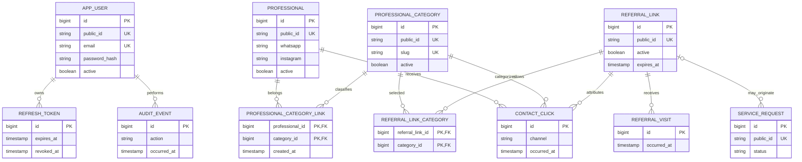

# Domain model

States follow [Scope and requirements](SCOPE_AND_REQUIREMENTS.md). `IMPLEMENTADO` may mean a persistence structure already exists even when its management use cases are still planned; each entity states that distinction.

## Common identity policy

Internal `BIGINT` IDs are database implementation details and foreign keys. Publicly addressable entities use a unique 21-character URL-safe `publicId`. The `PublicIdGenerator` uses `SecureRandom`, but no current creation flow invokes it. A public ID is an address, never an authorization token.

## Current entities

### AppUser — `IMPLEMENTADO` (schema only)

- **Responsibility:** represent a future administrative identity.
- **Attributes:** internal `id`, `public_id`, name, unique email, password hash, role, active, created/updated timestamps.
- **Relationships:** none implemented.
- **Invariants:** unique email/public ID; non-null password hash/role; no default credential.
- **Lifecycle:** identity use cases are `PLANEJADO_MVP`; activation/deactivation must preserve history.
- **History/retention:** timestamps exist; audit and identity retention policy are planned.
- **Evidence:** V1 `app_users`; no Java entity, repository, controller, or authentication flow exists.

### ProfessionalCategory — `IMPLEMENTADO`

- **Responsibility:** classify professionals for public discovery.
- **Attributes:** internal `id`, `publicId`, name, unique slug, optional description, active, created/updated timestamps.
- **Relationships:** many-to-many with `Professional` through `ProfessionalCategoryLink`.
- **Invariants:** unique slug/public ID; only active categories are public.
- **Lifecycle:** public reads exist; create/edit/activate/deactivate are `PLANEJADO_MVP`.
- **History/retention:** soft lifecycle is planned; current schema permits physical deletion but public code only reads.
- **Evidence:** V1/V2, category domain/JPA/repository/use cases/controller/tests.

### Professional — `IMPLEMENTADO`

- **Responsibility:** hold catalog and contact data for a partner professional.
- **Attributes:** internal `id`, `publicId`, name, business name, description, phone, WhatsApp, email, Instagram, city, state, active, timestamps.
- **Relationships:** many-to-many with categories.
- **Invariants:** unique public ID; only active professionals in active categories are public; public DTO omits internal ID, phone, email, active, and timestamps.
- **Lifecycle:** category-scoped and individual active-profile public reads exist; administration remains `PLANEJADO_MVP`.
- **History/retention:** deactivation must retain approved audit/analytics history.
- **Evidence:** V1/V3, professional domain/JPA/repository use cases, minimized DTOs, controller/security tests, and PostgreSQL profile integration.

### ProfessionalCategoryLink — `IMPLEMENTADO` (schema/queries)

- **Responsibility:** associate one professional with one category.
- **Attributes:** professional internal ID, category internal ID, creation timestamp.
- **Identity:** composite primary key; no public ID.
- **Relationships:** N:1 to each side, implementing N:N.
- **Invariants:** duplicate pair prohibited; cascading physical deletion currently configured.
- **Lifecycle:** association management is `PLANEJADO_MVP`.
- **History/retention:** the table currently has no active state or removal history; audit must preserve relevant changes.
- **Missing MVP capabilities:** no manual position/order, highlight, or own state. Position is `DECISAO_PENDENTE`; add only through a new migration if approved.

## Planned MVP entities

### RefreshToken — `PLANEJADO_MVP`

- **Responsibility:** renewable administrative session and revocation.
- **Attributes:** internal ID, token digest/identifier, user, issued/expiry/revoked timestamps, optional rotation family/reason.
- **Public ID:** not necessarily exposed; decision belongs to identity design.
- **Relationships:** many tokens/sessions to `AppUser`.
- **Invariants:** never store or log a reusable raw secret; expired/revoked/reused tokens cannot renew.
- **Lifecycle/history/retention:** rotate and revoke; retain security evidence for an approved bounded period.

### ReferralLink — `PLANEJADO_MVP`

- **Responsibility:** reusable, shareable context for curated referrals.
- **Attributes:** internal ID, non-predictable public ID, label, active, optional expiry, timestamps, creator/updater.
- **Relationships:** allowed categories through `ReferralLinkCategory`; visits and clicks.
- **Invariants:** inactive/expired links unavailable; only allowed active categories are exposed.
- **Lifecycle/history/retention:** create/edit/activate/deactivate; audit changes and retain analytics references.

### ReferralLinkCategory — `PLANEJADO_MVP`

- **Responsibility:** category allowlist per referral link.
- **Attributes:** link/category IDs, creation timestamp, optional approved position.
- **Identity:** composite key.
- **Invariants:** duplicate pair prohibited; only selected categories appear.
- **Lifecycle/history/retention:** replacement must be transactional and audited.

### ReferralVisit — `PLANEJADO_MVP`

- **Responsibility:** record an accepted visit to a referral context.
- **Attributes:** internal/event public ID as needed, link, server timestamp, minimized origin/session metadata.
- **Relationships:** N:1 referral link; optional dimensions only when approved.
- **Invariants:** valid link at acceptance; server time; privacy-minimized fields.
- **Lifecycle/history/retention:** append-oriented; raw retention/anonymization is `DECISAO_PENDENTE`.

### ContactClick — `PLANEJADO_MVP`

- **Responsibility:** record contact intent.
- **Attributes:** internal/event public ID as needed, referral link, category, professional, channel, server timestamp, minimized metadata.
- **Relationships:** N:1 link/category/professional.
- **Invariants:** supported channel and consistent link/category/professional relationship.
- **Lifecycle/history/retention:** append-oriented; failure, deduplication, privacy, and retention policies remain open.

### AuditEvent — `PLANEJADO_MVP`

- **Responsibility:** immutable evidence of relevant administrative/security actions.
- **Attributes:** internal ID, actor public reference, action, resource type/public reference, outcome, safe metadata, timestamp/correlation ID.
- **Relationships:** logical references that remain interpretable after deactivation.
- **Invariants:** no credentials/tokens/sensitive payload dumps; success events align transactionally with changes.
- **Lifecycle/history/retention:** append-oriented; protected from ordinary CRUD; retention must meet security/legal needs.

### ServiceRequest — `DECISAO_PENDENTE`

- **Responsibility:** structured service demand only if Alternative B is approved.
- **Potential attributes:** public ID, visitor contact/purpose, category/professional/link origin, status, timestamps.
- **Relationships/invariants/lifecycle/retention:** require a separate privacy, status, administration, and deletion design.
- **Current decision:** excluded from MVP acceptance unless explicitly approved.

## Domain diagram

Current physical tables are only `app_users`, `professional_categories`, `professionals`, and `professional_category_links`. Every other box is a proposed model, not an existing migration.
